<div align="center">

# 🐟 闲鱼助手（开源版）

**一套面向闲鱼卖家的自动化运营管理后台 — 账号、商品、订单、消息、自动发货、卡密、AI 自动回复，一站搞定。**


</div>

---

一套面向闲鱼卖家的**单用户开源版本**自动化运营后台，覆盖账号、商品、订单、消息、自动发货、卡密、AI 自动回复等核心场景。开箱即用，支持 Docker Compose 一键部署，也支持本地裸机开发。

遇到行为差异时，以当前仓库的代码、测试和文档为准。

## 📸 项目截图

| 控制台仪表盘 | 账号管理 |
| :---: | :---: |
| 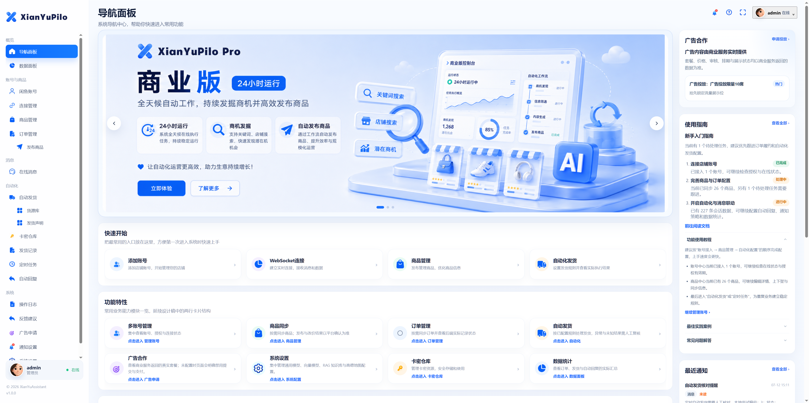 | 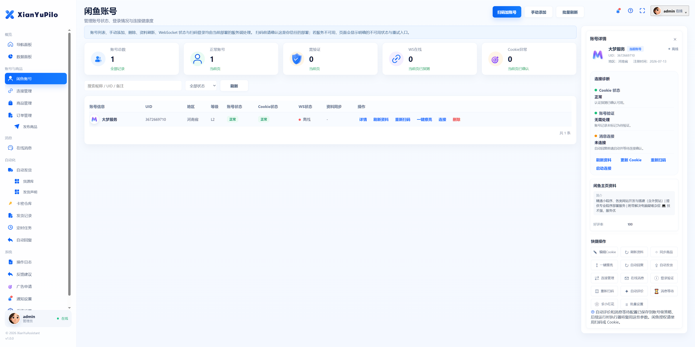 |

| 商品管理 | 订单管理 |
| :---: | :---: |
| 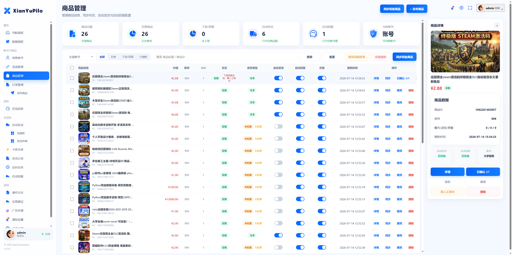 | 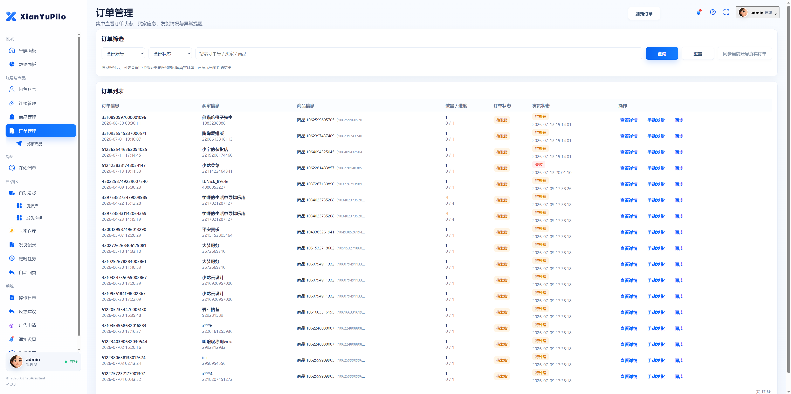 |

| 在线消息 | 自动发货 |
| :---: | :---: |
| 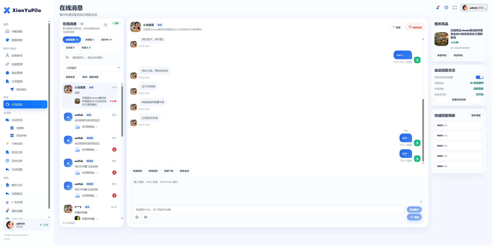 | 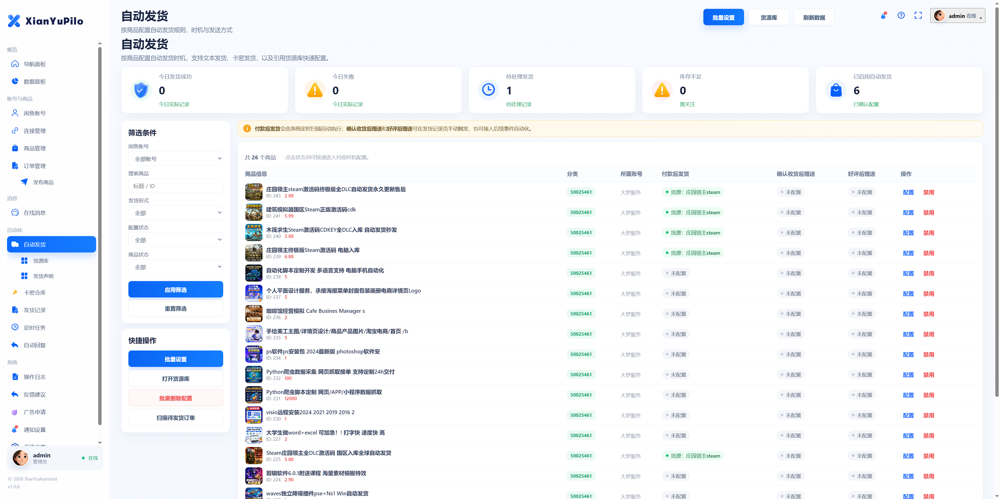 |

| AI 自动回复 | 商品发布 |
| :---: | :---: |
| 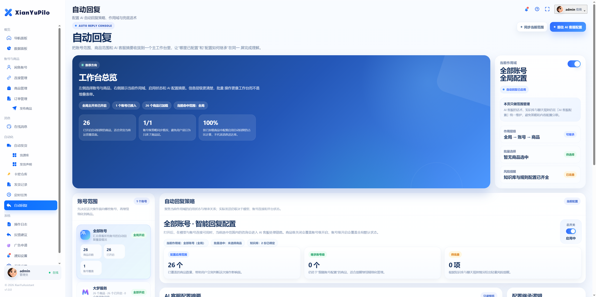 | 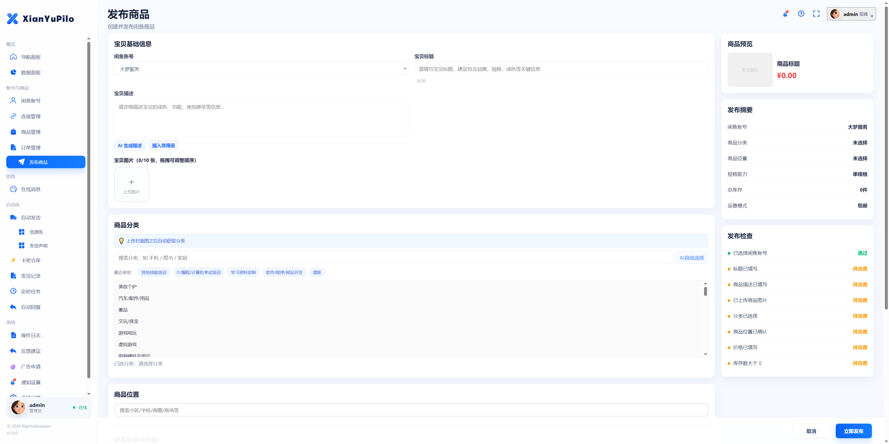 |

| 数据看板 | 系统配置 |
| :---: | :---: |
| 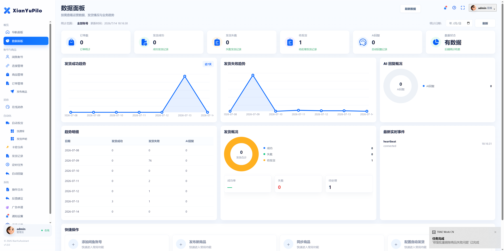 | 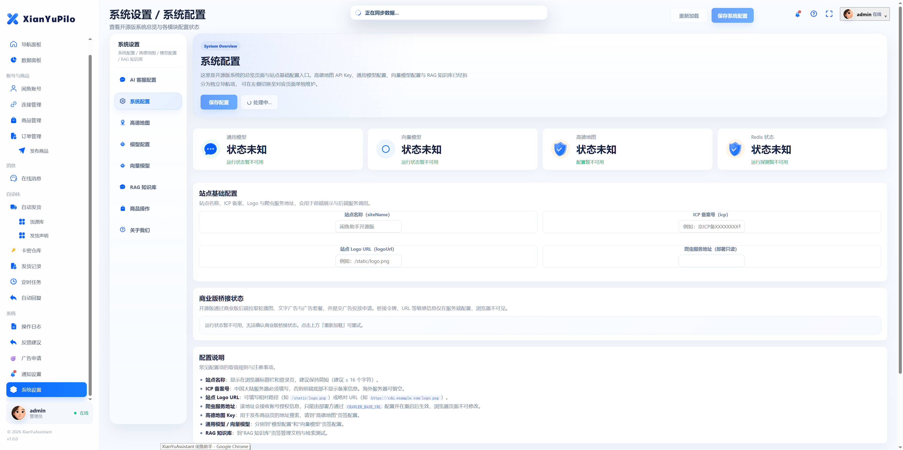 |

| 移动端 - 仪表盘 | 移动端 - 消息 |
| :---: | :---: |
| 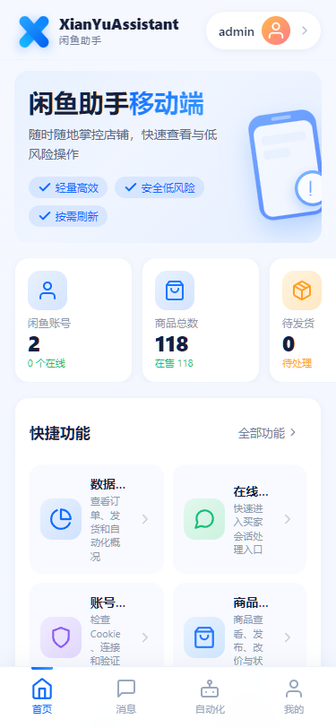 | 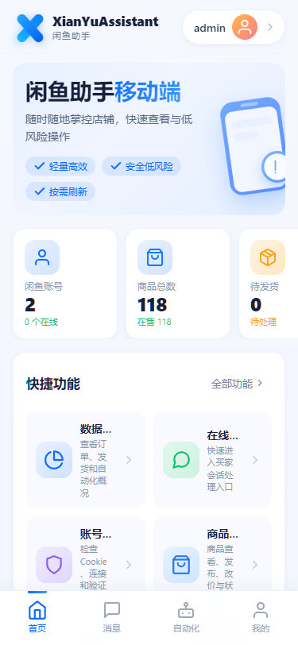 |

## ✨ 功能亮点

- 🧑‍💼 **闲鱼账号管理** — 多账号接入、二维码登录、状态监控
- 📦 **商品管理与发布** — 上下架、编辑、批量操作、分类
- 🧾 **订单管理** — 同步、跟踪、状态流转
- 💬 **在线消息** — 实时会话、WebSocket 长连接、分页回溯
- 🚚 **自动发货** — 卡密自动交付、实时与手动双通道
- 🎫 **卡密仓库** — 库存管理、去重、交付记录
- 🤖 **自动回复** — AI 驱动、知识库增强、人设与规则可配
- ⏰ **定时任务** — 调度执行、心跳与租约保护
- 📝 **操作日志** — 审计留痕、保留期管理
- 🔔 **通知渠道** — 持久化防重复测试发送，未知结果只能人工确认关闭
- 📚 **RAG 知识库** — 向量检索增强回复
- ⚙️ **系统配置** — 通用模型、向量模型、RAG、高德地图、商业版桥接状态
- 🧩 **Crawler 滑块求解** — 由 API 同会话维护的二维码登录
- 🏠 **首页运营** — 轮播、公告、文字广告、广告申请、关于我们
- 🔗 **反馈建议** — 向我们反馈功能建议

## 🖼️ 商业版预览
| 商业版 - 截图 1 | 商业版 - 截图 2 |
| :---: | :---: |
| 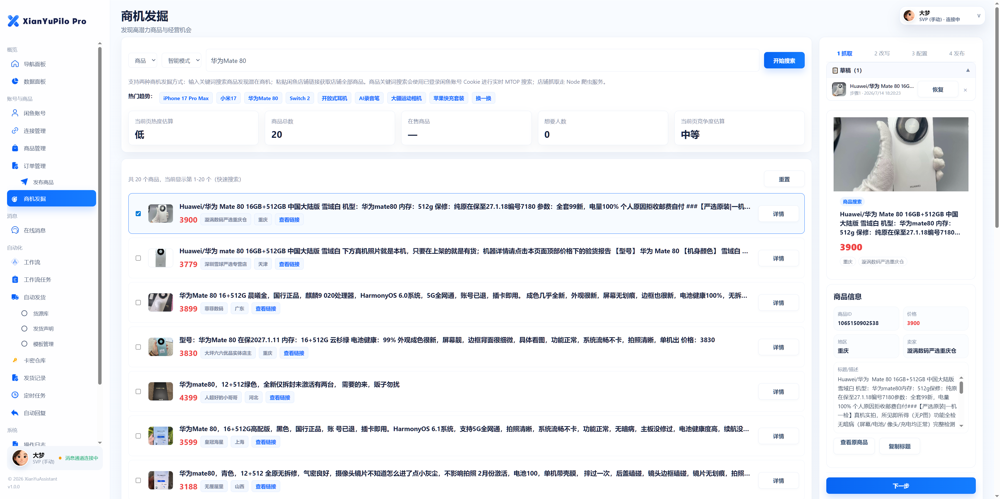 | 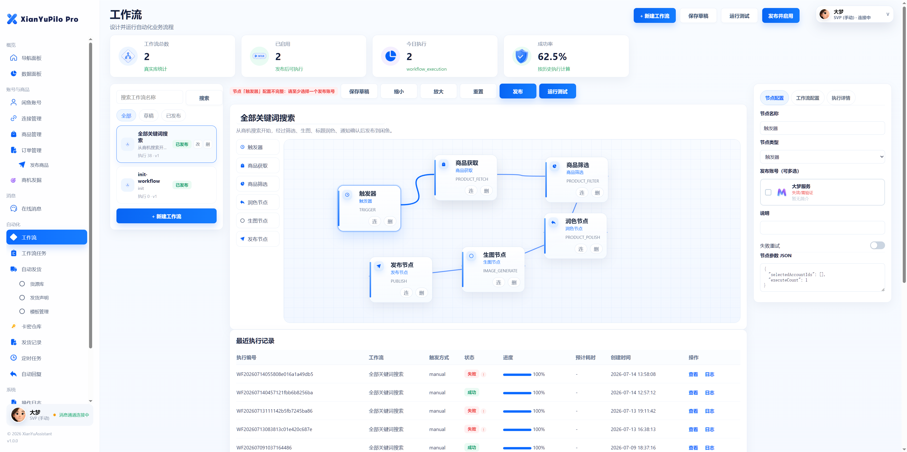 |

## 🏆 商业版服务

如果你需要更稳定、更强大的能力，或希望获得 **7×24 小时** 的技术支持与托管服务，欢迎了解我们的商业版：

👉 **[访问商业版服务](https://www.xianyupilot.com/#/)** 

商业版在开源版基础上提供更完善的多账号管理、商机发掘、工作流自动化、专属客服与运维保障。开源版与商业版可独立运行，互不冲突。

## 📋 功能参考

> 📌 **此处预留功能详细介绍位置** 

| 功能模块 | 说明 | 文档/演示 |
|------|------|--------|
| _商品搜索_ | _根据商品关键词爬取商品_ | _并可进行AI搬运润色、生图、发布_ |
| _店铺爬取_ | _根据店铺链接爬取商品_ | _并可进行AI搬运润色、生图、发布_ |
| _工作流_ | _自动根据设定规则发布商品_ | _可一次性发布多个账号，多个商品_ |

## 🧱 技术架构

| 层级 | 技术 |
|------|------|
| 后端 API | Python 3.11 + FastAPI + SQLAlchemy 2.0 |
| 前端 Web | Vue 3 + Vite |
| 爬虫服务 | Node.js 22 + TypeScript + Playwright |
| 数据库 | MySQL 8.0 |
| 缓存 | Redis 7 |
| 反向代理 | Nginx |
| 部署方式 | Docker Compose |

## 📁 目录结构

```text
xianyu-assistant-opensource/
├── apps/
│   ├── api/        # FastAPI 后端、SQL migration、上传目录挂载点
│   ├── crawler/    # Playwright 子服务，仅负责滑块求解
│   └── web/        # 合并后的 Vue 前端
├── deploy/         # MySQL 初始化脚本与 Nginx TLS 配置示例
├── docs/           # 本地运行与备份恢复文档
├── scripts/        # 生产运维与本地开发脚本
├── screenshots/    # README 截图
├── docker-compose.yml
├── start.bat / start.sh
└── .env.example
```

## 🚀 快速开始（生产候选部署）

### 前置要求

- 受支持的 Linux 与 Docker Engine
- 支持 `up --wait` / `--wait-timeout` 能力的 Docker Compose v2
- Python 3（用于不会回显秘密的启动前检查）
- 同机 TLS 反向代理/负载均衡器、备份、监控和密钥管理设施

### 安全启动方式

1. **复制环境变量模板**

   ```bash
   cp .env.example .env
   ```

   Windows 也可以直接运行 `start.bat`，脚本会在缺少 `.env` 时自动从模板创建。

2. **填写所有标记为 `REQUIRED` 的空项**，至少包括：

   - `ADMIN_PASSWORD_HASH_FILE`（文件内容为 bcrypt cost >= 12 的哈希，不写明文密码）
   - `MYSQL_ROOT_PASSWORD_FILE`、仅供迁移的 `MYSQL_MIGRATION_PASSWORD_FILE`、仅供 API/Worker 的 `MYSQL_APP_PASSWORD_FILE`（三组凭据不得复用）
   - `REDIS_PASSWORD_FILE`
   - `JWT_SECRET_FILE`
   - `COOKIE_CRYPTO_SECRET_FILE`
   - `INTERNAL_API_TOKEN_FILE`

   `.env` 只填写受保护的密钥文件路径，不填写密钥值。`./secrets` 目录建议权限为 `0700`，文件为 `0600`；每个密码/密钥必须独立随机生成，不能复用模板、开发或其他系统秘密。

3. **启动所有服务**

   ```bash
   sh ./start.sh
   ```

   Windows 使用 `start.bat`。脚本会依次执行秘密安全校验、`docker compose config --quiet`、镜像构建、容器健康等待和 Web 健康探测；任一必填秘密不安全时会拒绝启动。

   Compose 会先运行一次性 `migrate` 服务，再允许 API 和 Worker 启动；新库与旧库都走同一个带历史记录和 MySQL 单实例锁的版本化 runner。维护窗口、备份、状态检查和回滚兼容流程见 [`apps/api/migrations/README.md`](apps/api/migrations/README.md)。

4. **访问服务**

   Compose 默认仅把 Web 绑定到 `127.0.0.1:8080`，供同机 TLS 代理访问。API、Crawler、MySQL、Redis 只有容器内部地址，没有宿主机发布端口。不提供默认密码，也不开放生产 API 文档。对公网服务前必须从 HTTPS 域名验收。

   > API 错误同时使用真实 HTTP 状态码和顶层 `code/msg/data` 信封：参数错误、冲突、资源不存在、依赖不可用和内部错误不会再以 HTTP 200 伪装成功。调用方应以 HTTP 状态为主、信封错误码为业务细节；已退役兼容面统一返回 HTTP 410 和迁移指引。

## 🖥️ 本地开发

本地开发与生产部署是两条独立路径。生产 `docker-compose.yml` 会强制要求全部生产秘密，不应再被当作“只启动 MySQL/Redis”的无密码开发捷径。完整步骤、端口和 Windows 快捷入口见 [`docs/local-dev-runbook.md`](docs/local-dev-runbook.md)。

Crawler 的所有 `/api/*` 路由都应使用 `X-Internal-Token`；生产仅允许容器内 API 访问。健康检查是 `/health`，就绪检查是 `/ready`。

### Windows 快捷入口

如果你的机器没有 Docker，推荐直接使用这些脚本：

```bat
start-local.bat
status-local.bat
stop-local.bat
verify-local.bat
```

说明：

- `start-local.bat` 会先检查隔离端口、执行版本化数据库迁移和 Crawler 构建，再以受管后台进程启动 API、Crawler、Web，并等待三者就绪
- `status-local.bat` 查看本地 15177 / 15178 / 15176 端口和受管 PID 状态
- `stop-local.bat` 只停止 PID 文件与监听端口完全匹配的本项目进程；发现未受管监听器时会保留并告警
- `verify-local.bat` 会串行执行 Web 构建、API 编译检查和 Crawler 构建


### 代码中还支持的补充变量

以下变量在 `apps/api/app/core/config.py` 中也已支持；其中商业版桥接相关变量和 `INTERNAL_API_TOKEN_FILE` 已经写进 `.env.example`，这里只列仍需按需手动追加的部分：

- `APP_ENV`
- `AI_PROVIDER_ENABLED`
- `AI_PROVIDER_BASE_URL`
- `AI_PROVIDER_API_KEY`
- `AI_PROVIDER_MODEL`
- `AI_PROVIDER_TIMEOUT_SECONDS`
- `AMAP_API_KEY`

## 🌐 生产网络边界

| 服务 | 容器端口 | 宿主发布 |
|------|------|------|
| Web | `8080` | 默认 `127.0.0.1:8080`，应由 TLS 入口代理 |
| API | `12401` | 不发布，仅 Web/内部网络 |
| Crawler | `3001` | Compose 容器内私有端口，不映射宿主机，仅 API/内部网络 |
| MySQL | `3306` | 不发布，仅内部网络 |
| Redis | `6379` | 不发布，仅内部网络 |

## 🛠️ 常用命令

生产环境不要直接运行裸 `docker compose` 命令：Compose 顶层 secrets 需要由安全入口从受保护文件读入，并且只注入短生命周期子进程。启动、重建和上线验收始终走 `start.sh` / `start.bat`（内部调用 `scripts/verify_production.py`）；状态、日志和停止使用跨平台的固定命令包装器：

```bash
# 启动、构建、等待健康并验证真实 TLS 入口
sh ./start.sh
# Windows: start.bat

# 查看全部服务状态（包含已退出的一次性迁移服务）
python scripts/production_ops.py --env-file .env status

# 查看最近 200 行 API/Web 日志
python scripts/production_ops.py --env-file .env logs --tail 200 api web

# 持续跟随允许列表中的服务日志
python scripts/production_ops.py --env-file .env logs --follow --tail 200 api worker

# 停止并移除本项目容器和网络；不会删除命名卷或镜像
python scripts/production_ops.py --env-file .env stop
```

日志服务名仅允许 `mysql`、`redis`、`migrate`、`api`、`worker`、`crawler`、`web`；`--tail` 范围为 1–10000。不提供任意 Compose 参数透传，包装器会忽略宿主机残留的 Compose 项目/文件/profile 覆盖，并对已加载密钥做流式脱敏。需要再次启动时重新运行 `start.sh` / `start.bat`，以重新执行预检和本地/公网 TLS 就绪验证。


## 📚 参考文档

| 文档 | 说明 |
|------|------|
| [`docs/local-dev-runbook.md`](docs/local-dev-runbook.md) | 本地开发运行手册 |
| [`docs/backup-restore.md`](docs/backup-restore.md) | 备份与恢复 |
| [`apps/api/migrations/README.md`](apps/api/migrations/README.md) | 数据库迁移说明 |
| [`SECURITY.md`](SECURITY.md) | 安全策略 |
| [`CONTRIBUTING.md`](CONTRIBUTING.md) | 贡献指南 |

## 🤝 贡献

欢迎提交 Issue 与 Pull Request。提交前请先阅读 [`CONTRIBUTING.md`](CONTRIBUTING.md)，并确保本地 `verify-local.bat`（或对应脚本）通过。

## 🧸 特别鸣谢

本项目在开发过程中参考了以下开源项目，特此致谢：

- [xianyuapis](https://github.com/IAMLZY2018/xianyuapis) — 闲鱼相关 API 的实现思路与协议参考。

## 📄 许可证：Apache-2.0 许可证

本项目采用 [Apache License 2.0](LICENSE) 授权。任何人可在遵守该许可证条款的前提下自由使用、修改和分发本仓库代码。

---

## 💖 赞助

如果这个项目帮助到了你，或者你通过它赚到了钱，并且你愿意的话，希望你能赞助支持我的持续开发与维护工作。你的支持是我继续迭代、修复问题、添加新功能的动力。

<div align="center">


</div>

## 💬 微信交流群

欢迎加入微信交流群，与更多闲鱼卖家和开发者一起交流使用心得、反馈问题、获取最新动态。

> 📌 **微信群二维码位置预留** — 届时我会在此附上微信群二维码。

<div align="center">


</div>

<div align="center">

<sub>Made with care for the 闲鱼 seller community.</sub>

</div>
